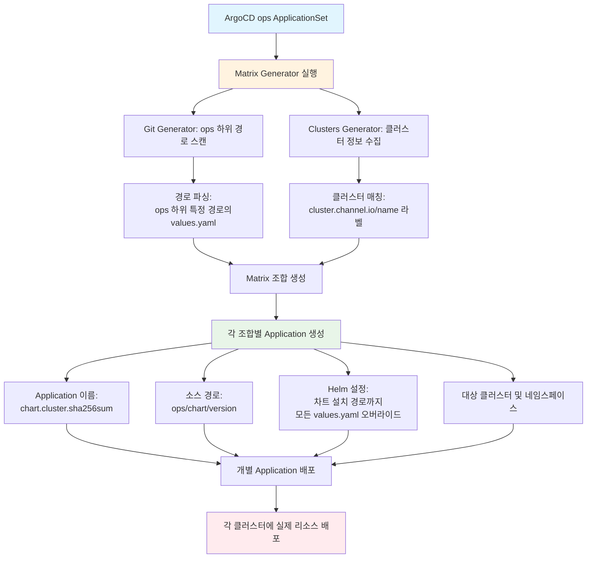

## [ 1. 채널톡 전화 서비스 (Meet) 인프라 아키텍처 운영 및 최적화 ]

**기간**: 2023.08 ~ 현재
**개요 및 역할**: 실시간 통신의 엄격한 네트워크 요건(SIP, WebRTC)을 반영한 인프라 구축, 비용 최적화를 위한 스케일링 전략 수립, 만성 장애 원인 규명 및 딥다이브 해결

**주요 성과 및 트러블슈팅**

- **Kubernetes 환경 WebRTC 묵음 장애 원인 규명 및 방어 로직 구현**

  - **[현상]**: WebRTC 서버 스케일링 과정에서 약 25%의 통화에서 간헐적 묵음 현상 발생.
  - **[원인분석]**: EIP 할당 API 성공 응답 시점과 실제 인바운드 트래픽이 뚫리는 라우팅 허용 시점 사이에 **평균 1초 내외의 시간차(Time gap)**가 존재하여 애플리케이션의 State Mismatch가 발생함을 규명.
  - **[해결 및 성과]**: 단순 Sleep 방식이 아닌 AWS Tag와 EIP Pool 부착 여부를 루프로 검증하는 확정적 네트워크 연결 방어 로직을 구현. 도입 직후 묵음 오류를 **0%**로 근절.

- **메커니즘 충돌 해소: LiveKit Egress 트래픽 Drop 장애 해결**

  - **[현상]**: Kubernetes HPA(실제 CPU 기반)와 Egress 서버 내부 Capacity 로직 간의 충돌로, 15~30%의 낮은 CPU 사용량에도 불구하고 트래픽 Drop(손실) 장애가 발생.
  - **[원인분석]**: Go 기반 LiveKit 소스코드를 열어 분석하여 서버 워커 어피니티(Worker Affinity)에 의한 집중 로직 확인 후 `k6` 부하테스트 환경을 구축하고 통제 반복 실험 진행.
  - **[해결 및 성과]**: 부하 테스트 결과를 바탕으로 최적 스케일링 기준(CPU 60~70%) 수립. 드롭 이슈를 원천 차단하고 통화 녹음/STT 서버 비용 효율성을 획기적으로 향상.

- **EKS 마이그레이션 중 권한(IRSA) 이슈 딥다이브 해결**
  - **[현상]**: ECS → EKS 기반 이전 중 특정 애플리케이션에서 `AccessDenied`로 마이그레이션 전면 블로킹 발생.
  - **[원인분석]**: CloudTrail과 코드 레벨 분석 결과, 애플리케이션 내부의 AWS SDK Credential Provider Chain이 잘못된 Custom Endpoint Resolver에 의해 STS 요청 필수 옵션을 누락시키고 있음을 규명.
  - **[해결 및 성과]**: 누락 옵션들을 명시적으로 주입하도록 앱 코드를 직접 수정 가이드하여 EKS 마이그레이션 속행 성공.

---

## [ 2. 사내 인프라 셀프 서비스(QWER) 플랫폼 아키텍처 고도화 ]

**기간**: 2026.01 ~ 2026.04
**개요 및 역할**: 개발자 생산성(DX)과 인프라 안정성을 동시에 챙기기 위해, 오픈소스 및 내부 툴링을 결합한 인프라 셀프 서비스 플랫폼 구축

**주요 성과 및 트러블슈팅**

- **인프라 셀프 서비스 포털 구축 및 리소스 운영 자동화**

  - **[현상]**: 잦은 인프라/권한 발급(SQS 생태계 등) 요청이 복잡한 GitOps YAML로 얽혀 있어 인프라 팀 개입에 따른 병목과 휴먼 에러 가능성이 컸음.
  - **[개선 및 성과]**: 인프라 배포 로직을 추상화하는 `InfraSpecProvider`, `ProvisionActionExecutor`를 도입. 매니페스트 조작을 단순 치환에서 Node 기반 Tree 연산으로 리팩토링. 개발자가 관리자 없이 안전히 권한을 획득할 수 있는 포털 생태계를 안착시켜 리드 타임을 극단적으로 좁힘.

- **대규모 자격 증명 아키텍처 무중단 마이그레이션 (IRSA → Pod Identity)**
  - **[원인분석]**: 레거시 인증 체계인 IRSA를 EKS Pod Identity로 교체해야 했으나, Terraform 내부 로직상 Destroy/Recreate가 강제되어 운영 서비스의 무차별적 프로덕션 인증 장애(Downtime) 리스크 직면.
  - **[해결 및 성과]**: AI/LLM 에이전트 도구를 파이프라인 단계에 추가하여 Terraform의 `moved.tf`를 동적 생성하는 파이프라인 기법 채택. 단 1초의 인증 장애 없이 14개 이상의 Exp/Prod 프로젝트 무중단 마이그레이션 성공.

---

## [ 3. 대규모 인프라 관리를 위한 IaC 파이프라인(Terraform) 개편 ]

**기간**: 2024.07 ~ 2024.12
**개요 및 역할**: 비대해지고 정체된 Terraform 아키텍처를 재설계 및 고도화하여 다수 개발자의 동시 협업 가능한 안전 환경 확보

**주요 성과 및 트러블슈팅**

- **IaC 구조 개편 및 Atlantis 기반 CI/CD 스케일업**
  - **[현상]**: 단일 State로 인프라가 관리되어 `plan` 1회 실행 시 최소 12분이 소요되고 파이프라인 동시 작업 불가. 대규모 배포 시 Atlantis 캐시 서버 OOMKilled 빈번 발생.
  - **[해결 및 성과]**:
    1. Terragrunt를 전면 도입하여 Account / Region / Stage 단위 통짜 State 완전 분해 완료. 단일 모듈 수정을 **30초 내로** 가속. (기존 속도 대비 80% 단축)
    2. Atlantis 캐시 서버 내 Provider Data Schema 파싱 레이어 메모리 누수 분석. 워커(Worker) 노드 풀 사이즈 최적화를 통해 CI/CD OOMKilled 빈도를 **0%**로 억제해 만성 배포 지연 현상 근절.

---

## [ 4. Multi Cluster (Hub-Spoke) 통합 관리 환경 구축 ]

**기간**: 2025.05 ~ 2025.08
**개요 및 역할**: 계정/리전 별로 무제한 확장 가능한 Kubernetes 운영 전반의 Hub Architecture 개발

- **안전하고 일관된 클러스터 배포 프로비저닝 구조 마련**
  - **[성과]**: ArgoCD ApplicationSet 매트릭스(Matrix), 폴더(Git), 클러스터(Cluster) Generator의 결합 구문 분석을 통해 중앙(Hub)에서 대상(Spoke) 클러스터로 인프라 차트, 로깅, 시크릿 등을 일괄 자동 프로비저닝.

---

## [ 5. 에이전틱(Agentic) 업무 리듬 자동화 및 DevSecOps 파이프라인 구축 ]

**개요**: 개발자의 로컬 디바이스와 AI 에이전트 간 협업 사이클에서 보안과 개발자 경험(DX) 자동화 시스템화

- **업무 리듬 시스템 통합 및 커스텀 AI 워크플로우 구성**

  - Issue Tracker(Linear)와 터미널 환경을 동기화하는 `/lt-daily` 로컬 툴링 릴리즈. AI 코딩 보조의 파괴적 수정을 막기 위한 Plan-first 컨텍스트 검수 스크립트 작성 등 예측 무결성을 갖춘 엔지니어링 수행.

- **로컬 Dotfiles 보안 마스킹 (`sync.sh`) 인프라 자동화**
  - 수많은 로컬 설정(Dotfiles)을 GitHub으로 동기화 시 민감 토큰 유출 사례 방지를 위해 단일 `.secrets.yaml` 기반 마스킹 치환 스크립트 구축. `jq/sed`를 통해 커밋 전 `<REDACTED>` 자동 치환 누락 여부를 스캔하는 로컬형 DevSecOps 규율 구축.
