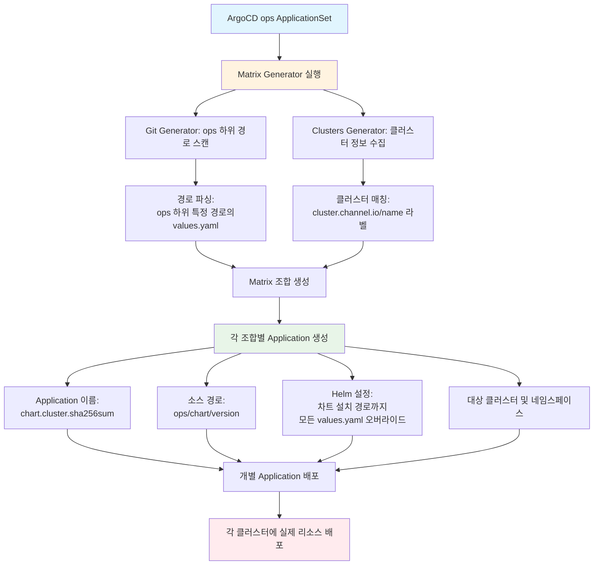

## [ 사내 내부 개발자 플랫폼(IDP) 아키텍처 고도화 ]

**개요**

- 개발자 생산성(DX)과 인프라 안정성을 동시에 확보하기 위해, 오픈소스 및 내부 툴링을 결합한 인프라 셀프 서비스 플랫폼을 구축하는 프로젝트

**기간**

- 2026.01 ~ 2026.04

**역할**

- IDP 인프라 추상화 로직 설계 및 포털 구현
- IaC Repository 연동 파이프라인 아키텍처 설계 및 구축
- 공용 Terraform 모듈의 IDP 호환 버전 업그레이드 및 전체 프로젝트 적용

**성과**

- 기존 IaC Repository를 Source of Truth로 유지하면서, 개발자가 인프라 지식 없이도 직접 리소스(SQS 등)와 권한을 발급받을 수 있는 셀프 서비스 환경 확보
- IDP에서 IaC Repository로 PR을 생성하고, CI/CD 수행 후 결과를 Webhook으로 수신하여 IDP에 연동하는 파이프라인 구축
- 전체 애플리케이션 프로젝트가 사용하던 공용 Terraform 모듈을 IDP 구조에 맞게 업그레이드하고, Claude Code Skill 및 AI Agent를 활용하여 모든 프로젝트에 대한 코드 수정과 호환성 검증을 단기간 내에 완수

**세부 사항**

- 인프라 배포 로직을 추상화하는 `InfraSpecProvider`, `ProvisionActionExecutor` 도입
- 매니페스트 조작을 단순 치환에서 Node 기반 Tree 연산으로 리팩토링하여 안정성 확보
- AI Agent 도입 시 맞춤형 프롬프트를 설계하여 대규모 반복 프로비저닝 작업을 자동화

---

## [ Multi Cluster 환경 구축 ]

**개요**

- N 개의 AWS Account, Region, EKS Cluster 에 대해 생성 및 삭제, 워크로드 배포를 위한 클러스터 프로비저닝 등, 이를 관리할 수 있는 환경을 구축하는 프로젝트

**기간**

- 2025.05 ~ 2025.08

**역할**

- Hub-Spoke 클러스터 구조 설계 및 구현
- 클러스터 프로비저닝 구현 - Terraform, ArgoCD 활용
- 클러스터 설정, 애플리케이션 Helm Chart, 운영 도구 설정 관리 개선
  - GitOps 저장소 구조 변경 및 ArgoCD ApplicationSet 활용, 관리용 차트 개발
- 기존 클러스터 및 애플리케이션 마이그레이션

**성과**

- 애플리케이션별로 관리되던 공용 Helm Chart와 클러스터별로 관리되던 운영 도구 Helm Chart를 각각 하나의 차트로 통일하도록 개선하여 차트 관리 부담 완화
- 시스템이 자동으로 관리하는 영역과 사람이 직접 관리하는 영역에 대한 정의 및 분리
- 클러스터나 운영 도구, 애플리케이션이 여러 리전에 걸쳐 추가되더라도 일관된 코드로 관리 가능

**세부 사항**

- 네트워크
  - Hub VPC는 다른 모든 VPC와 피어링하고, Hub에서의 Outbound는 모두 허용, Inbound는 필요에 따라 허용
- Spoke 클러스터 프로비저닝 플로우
  - 각 운영 도구에서 환경별로 달라지는 설정을 포함한 values.yaml 작성
  - Spoke 클러스터의 개별 설정을 포함한 Terraform 코드 작성 & PR
    - Spoke 클러스터 생성됨
    - karpenter, EKS Addon 등 운영 도구 관련 리소스 생성됨
    - Hub ArgoCD에 Spoke 클러스터 등록됨
  - ArgoCD ApplicationSet으로 Spoke 클러스터에 운영 도구 프로비저닝

---

## [ 채널톡 전화 서비스 (Meet) 운영 ]

**개요 & 역할**

- 채널톡 전화 서비스의 구축부터 트러블슈팅, 장애 대응을 포함한 인프라 운영을 담당

**기간**

- 2023.08 ~

**성과**

- Meet에서의 사용 사례에 맞게 녹음 서버 설정을 수정하여 추천 설정 대비 처리량 70% 증가
- WebRTC 서버 스케일링시 간헐적으로 발생하는 묵음 현상을 해결하여 기술 블로그 기재 [#](https://channel.io/ko/team/blog/articles/Kubernetes-%ED%99%98%EA%B2%BD%EC%97%90%EC%84%9C-WebRTC-%EC%84%9C%EB%B9%84%EC%8A%A4%EC%9D%98-%EB%AC%B5%EC%9D%8C-%ED%98%84%EC%83%81-%ED%8C%8C%ED%97%A4%EC%B9%98%EA%B8%B0-1dc56e4a)

**세부 사항**

- 여러가지 제약을 고려한 인프라 설정
  - 국내 통신사와의 SIP 통신은 인바운드와 아웃바운드의 IP와 Port가 지정되어 있음 → Proxy를 구성하고 노드를 분리하여 EIP 할당, hostNetwork를 사용
  - 통신사와 협업 시, 원활한 소통과 디버깅 용도의 pcap 파일 필요 → tshark를 이용하여 사이드카에서 트래픽을 캡처 후, S3에 업로드
  - 내부망을 사용하는 고객사에 Meet 서비스 제공 → EIP 대역을 확보하여 WebRTC 미디어 서버 가동 시, 인스턴스의 Primary ENI에 EIP 할당 & 고객사에 IP 대역에 대해 방화벽을 열도록 가이드
- 부하테스트를 통해 녹음 타입별 cpu cost 조정
  - 녹음 서버에서는 통신 품질을 위해 CPU Capacity와 Usage를 직접 관리함
  - 녹음 요청을 분산하여 처리하지 않고, CPU Capacity가 가득 찰 때까지 Idle이 작은 서버가 높은 우선순위로 처리하는 로직을 확인함
  - 기획 단계의 최대 사용자 및 룸 기준으로 부하테스트를 수행하여 녹음 타입별 적절한 cpu cost를 찾아서 적용함
  - 평균 CPU 60%를 기준으로 스케일링 정책을 확정하고 민감도를 고려해 업무시간에는 2대 예비 서버를 확보하도록 설정하여, 현재까지 큰 수정 없이 안정적으로 운영 중
- 비용 최적화를 위해 STT 요청을 SQS에 쌓고 Spot 위주에서 서빙
  - Spot capa를 미리 늘리고, Keda를 활용하여 SQS의 가장 오래된 메세지의 대기 시간을 기준으로 스케일링 되도록 설정
  - STT 시간을 줄이는 과제에서, STT를 처리를 위해 준비/처리하는 구간으로 나누어 각 구간을 측정할 수 있는 지표를 수집하고, 이를 개선하는 방향으로 진행함.
    - 최종적으로 일간 가장 오래 걸린 STT의 1주일 평균 기준, 50% 이상 줄어듦 (1시간 30분 → 40분 이내)
  - 개선 가능한 부분
    - 모든 고객사가 동일한 Pool을 사용하여, 낮은 요금을 지불하는 고객사가 긴 통화를 수행하더라도 모든 고객사에게 영향을 받는 구조
    - 순차처리 구조로 인해 긴 통화가 앞에 다수 존재하는 경우 뒤의 짧은 통화들이 모두 대기해야 하는 구조
    - 모든 통화에 대해 STT를 수행
    - k8s의 gateway api inference extension을 이용하면 spot과 on-demand 사이의 트래픽 조절도 가능할 것으로 기대

---

## [ IaC 인프라 관리 체계 개선 및 자동화 ]

**기간**

- 2024.07 ~ 2024.12

**배경**

- Region/Stage 기준으로 state가 분리되어 있지만 예외가 다수 존재하여 관리 복잡성이 높았으며, 이로 인해 중복된 코드가 많았음. 또한, 무거운 state는 terraform plan 실행 시 오랜 시간이 소요되었음
- 모든 환경이 단일 모듈을 공유해 작은 변경도 전 환경에 영향을 미쳐, 안전한 개별 수정이 어려움
- CI/CD 파이프라인의 부재로 인해 동시 작업 불가

**역할**

- state를 나누는 정책 및 프로젝트 구조 설계
- 새로운 도구(Terragrunt, Atlantis) 도입 및 작업 방식 개편
- 모듈 관리 방식 개편

**성과 & 세부 사항**

- Terraform state를 세부적으로 분할하고, 여러 작업자가 다른 환경에 동시에 작업할 수 있도록 개선
- Terragrunt 도입과 함께 Git Repository 구조를 Account, Region, Stage 기준으로 재편하여 코드의 재사용성을 극대화함
- Terraform 모듈을 버저닝하고 AWS S3에서 중앙 관리함으로써 모듈 수정에 대한 부담을 경감하고 안정적인 배포 환경을 구축함
- Atlantis 기반 CI/CD 파이프라인으로 작업자 간 충돌 방지 및 배포 과정 자동화
- Github Webhook을 통해 수신된 정보를 Okta에서 관리하는 기준에 맞춰 인가 여부를 판단하도록 구성

---

## [ 장애 대응 및 개선 ]

### 1. WebRTC 서버 스케일링 시 간헐적으로 발생한 묵음 현상

> 트러블슈팅 과정을 작성한 기술 블로그: [https://channel.io/ko/team/blog/articles/1dc56e4a](https://channel.io/ko/team/blog/articles/1dc56e4a)

**배경**

- WebRTC 서버를 피크 타임에 맞춰 스케일링하는 과정에서 간헐적으로 묵음 현상이 발생하였으며, 특정 서버에서 반복적으로 ICE 연결 실패가 관찰됨

**단기 대응**

- 장애 발생 전후로 변경된 피크 타임 스케일링 설정을 우선 롤백함
- 로그 분석을 통해 문제가 특정 파드에서만 발생함을 확인하고, 임시적으로 해당 Pod를 재시작하여 서비스 정상화함

**Root Cause 분석 및 해결**

1. **첫 번째 가설:** Private IP를 사용하는 고객은 정상적으로 연결되었지만, Public IP를 사용하는 상담원의 연결에서 문제가 발생. 그러나 Public IP와 관련된 로그와 메트릭에서 정상적으로 설정된 것을 확인
2. **두 번째 가설:** 종료된 WebRTC 서버의 EIP 정보가 Redis에 남아 잘못된 EIP로 ICE 연결을 시도했을 가능성을 점검. 그러나 Redis 정리가 정상적으로 이루어진 것을 확인
3. **결정적 단서:** 서버가 삭제된 후 동일한 노드에 다시 생성되는 경우, **EIP 할당/적용 시점과 WebRTC 서버 실행 시점 간의 타이밍 불일치**로 인해 구(舊) EIP 정보가 Redis에 잘못 등록됨
   - 그 결과, 잘못된 Public IP가 ICE 과정에서 전달되며 묵음 현상이 발생함을 확인
   - 실제로 EIP 할당과 시스템 적용 간 약 1초의 지연이 존재함을 파악하고, **EIP 적용 완료 여부를 검증하는 방어 로직을 추가**하여 문제를 근본적으로 해결함

### 2. GracefulShutdown 지연으로 인한 로그 손실 문제

**배경**

- GracefulShutdown이 오래 걸리는 Pod에서 로그가 중간에 끊기는 현상이 발생하였으며, 종료 시 로그 수집 agent가 로그를 완전히 전달하지 못하는 상황이 확인됨

**단기 대응**

- 로그 수집 agent의 terminationGracePeriodSeconds 값을 증가시킴
- Pod 종료 시점에 Kubernetes API를 폴링하며 대기하는 preStop hook 스크립트를 작성하여, 종료 전 로그 전달이 완료되도록 조치함

**Root Cause 분석 및 장기 전략 수립**

- karpenter(v0.35.0)가 노드를 종료하는 과정에서 Pod의 **PriorityClass**만 비교하여 critical priorityclass가 아닌 경우 동일한 우선순위로 evict함을 확인함
- 이를 기반으로 다음 두 가지 대응안을 검토함
  1. **로그 파이프라인 분리:** 로그를 stdout으로 출력하지 않고, 서버에서 직접 로그 수집기로 전송하는 별도의 파이프라인을 구성
  2. **단기 대응 유지:** preStop 및 GracePeriod 조정 방식을 유지하며, 향후 Observability 개선 시 로그 파이프라인 변경 고려
- 논의 결과, 단기 대응 방식을 유지하되 Observability 개선 과제 내에서 로그 파이프라인 분리를 함께 검토하기로 결정함
- 이후 karpenter 버전 업그레이드(v1.1.0+) 시, **DaemonSet과 PriorityClass를 모두 고려한 Pod 종료 로직이 추가됨**을 확인하여 관련 개선 과제의 우선순위를 조정함
